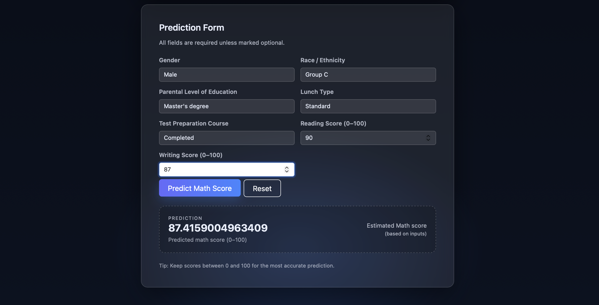

# 🎓 Student Exam Performance Predictor  
**End-to-End Machine Learning Project | Data Science • MLOps • Cloud Deployment**  

**Author:** Raghav Aggarwal  

---

## 🚀 Project Overview

This project demonstrates a **full, industry-style machine learning lifecycle** — from exploratory data analysis (EDA) and model experimentation to **production deployment using Docker, CI/CD, and AWS**.

The application predicts a student’s **Math score (0–100)** based on demographic and academic features such as gender, parental education, lunch type, and reading/writing scores.  
It is deployed as a **Flask web application**, containerized with **Docker**, and hosted on **AWS EC2** using **GitHub Actions (self-hosted runner)**.

This project is designed to reflect **real-world ML engineering practices** and is intended to be **resume- and recruiter-ready**.

---

## 🧠 Problem Statement

Accurately estimating academic performance can help educators and institutions identify patterns, gaps, and areas of improvement early.  
The goal of this project is to build a robust regression model that predicts a student's **Math exam score** using contextual and academic inputs.

---

## 📊 Dataset

- **Source:** Kaggle – Student Performance in Exams  
  🔗 https://www.kaggle.com/datasets/spscientist/students-performance-in-exams  
- **Size:** 1000 rows × 8 columns  
- **Target Variable:** `math_score`  
- **Features:**
  - Gender
  - Race / Ethnicity
  - Parental level of education
  - Lunch type
  - Test preparation course
  - Reading score
  - Writing score

---

## 🔍 Exploratory Data Analysis (EDA)

EDA was conducted to:
- Understand score distributions and feature relationships
- Identify influential demographic and academic factors
- Validate assumptions for downstream modeling

### Key Insights
- Math performance is influenced by **parental education, lunch type, and race/ethnicity**
- **Females outperform males** on average in overall scores
- Completing the **test preparation course is beneficial**
- Reading and writing scores are strongly correlated with math performance

EDA and visualizations are available in:
```
notebook/1. EDA STUDENT PERFORMANCE.ipynb
```

---

## 🧪 Modeling & Training

### Preprocessing
- **Categorical features:** OneHotEncoder
- **Numerical features:** StandardScaler
- **Train–Test Split:** 80 / 20
- **Pipeline-based preprocessing** for training and inference consistency

### Models Evaluated
- Linear Regression  
- Ridge Regression  
- Lasso Regression  
- K-Nearest Neighbors  
- Decision Tree  
- Random Forest  
- XGBoost Regressor  
- AdaBoost Regressor  

### Hyperparameter Tuning
- **GridSearchCV**
- `cv=3`, `n_jobs=-1`, `refit=True`

---

## 🏆 Model Performance Summary (Test Set)

| Model | R² Score |
|------|----------|
| **Ridge Regression** | **0.8806** |
| Linear Regression | 0.8804 |
| Random Forest | 0.8500 |
| AdaBoost | 0.8493 |
| XGBoost | 0.8278 |
| Lasso | 0.8253 |
| KNN | 0.7837 |
| Decision Tree | 0.7322 |

📌 **Final Model Selected:** Ridge Regression  
- Best balance of bias–variance
- Strong generalization on unseen data
- Simple and interpretable baseline

---

## 🌐 Web Application

The trained model is exposed via a **Flask web app** that allows users to:
- Enter demographic and academic inputs
- Instantly receive a predicted Math score

### UI Highlights
- Clean, modern interface
- Form validation and user-friendly inputs
- Real-time inference using persisted artifacts

---

## 🖼️ Application Screenshots

### Landing Page

<p align="center">
  
</p>


### Prediction Form

<p align="center">
  
</p>

---

## ⚙️ End-to-End ML Workflow (How It Works)

1. **EDA & Data Validation**  
   Understand distributions, correlations, and feature relevance.

2. **Feature Engineering & Preprocessing**  
   Consistent transformation using pipelines for training and inference.

3. **Model Training & Hyperparameter Tuning**  
   Multiple regression models evaluated using cross-validation.

4. **Artifact Persistence**  
   Trained model and preprocessing pipeline saved for reproducibility.

5. **Flask Inference API + UI**  
   Model served via REST endpoint with a web interface.

6. **Containerization (Docker)**  
   Application packaged into a portable Docker image.

7. **CI/CD with GitHub Actions**  
   Automated build & deployment using a **self-hosted EC2 runner**.

8. **AWS Deployment**  
   - Image pushed to **Amazon ECR**
   - Container run on **EC2 instance**

---

## ☁️ Deployment & MLOps Stack

- **Backend:** Flask
- **ML:** scikit-learn, pandas, numpy
- **Containerization:** Docker
- **CI/CD:** GitHub Actions (self-hosted runner)
- **Cloud:** AWS (ECR + EC2)
- **Version Control:** Git & GitHub

---

## 📁 Project Structure

```
ML_Project/
├── .github/workflows/
│   └── aws.yml
├── notebook/
│   ├── 1. EDA STUDENT PERFORMANCE.ipynb
│   └── 2. MODEL TRAINING.ipynb
├── src/
│   ├── components/
│   ├── pipeline/
│   ├── exception.py
│   ├── logger.py
│   └── utils.py
├── templates/
│   ├── home.html
│   └── index.html
├── artifacts/
├── logs/
├── app.py
├── Dockerfile
├── requirements.txt
├── setup.py
└── README.md
```

---

## ▶️ Running Locally (Optional)

```bash
docker build -t student-performance-app .
docker run -p 8080:8080 student-performance-app
```

Access at: `http://localhost:8080`

---

## 🔮 Future Improvements

- Deploy inference UI on **Streamlit or Vercel** for easy public access
- Add **model monitoring & logging**
- Integrate **MLflow** for experiment tracking
- Add unit tests and data validation checks
- Extend prediction to multi-subject scoring

---

## 📌 Key Takeaways (For Recruiters)

- Demonstrates **end-to-end ML ownership**
- Strong understanding of **data science + MLOps**
- Production-style pipelines and deployment
- Clean, interpretable modeling with solid evaluation
- Real cloud infrastructure (AWS) + CI/CD automation

---

✅ **This project reflects how machine learning systems are built, shipped, and operated in real-world environments.**
